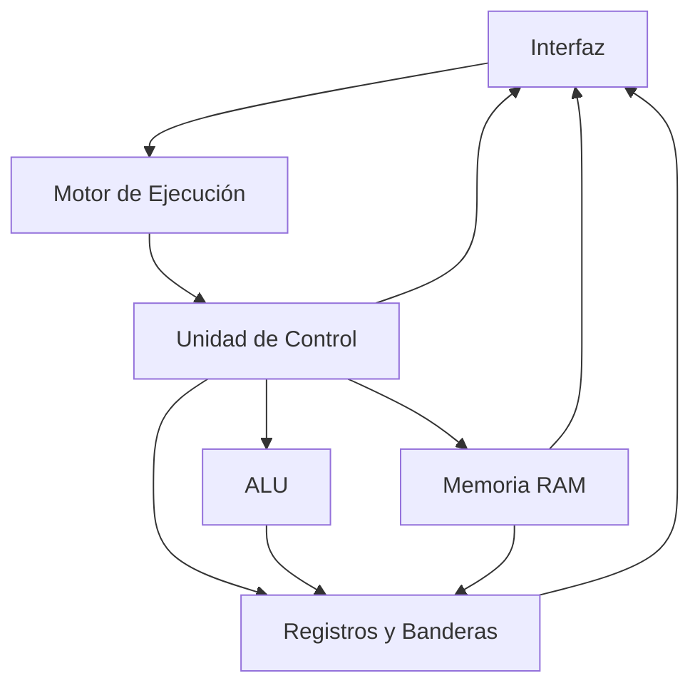

# 🖥️ Simulador de CPU de 8 bits

Simulador interactivo y visual de una **CPU de 8 bits basada en la arquitectura de von Neumann**, desarrollado en **Google Sheets y Google Apps Script (JavaScript)** para la materia **Arquitectura de Computadoras**.

El proyecto permite observar paso a paso el funcionamiento interno de un procesador: acceso a memoria, movimiento de datos entre registros, operaciones de la ALU, actualización de banderas, saltos y ejecución del ciclo completo:

**Fetch → Decode → Execute → Store**

---

## 📌 Características principales

El simulador incluye:

- RAM de **256 bytes**, direccionada desde `00h` hasta `FFh`.
- Representación visual de memoria mediante una matriz **16 × 16**.
- Segmentación lógica entre **código (`00h–7Fh`)** y **datos (`80h–FFh`)**.
- Registros `PC`, `IR`, `MAR`, `MDR`, `AX` y `BX`.
- Banderas `ZF`, `CF` y `SF`.
- ALU de 8 bits.
- Unidad de Control.
- Ciclo completo `Fetch → Decode → Execute → Store`.
- ISA propia con instrucciones de transferencia, aritmética, comparación y control de flujo.
- Ejecución **paso a paso (STEP)**.
- Ejecución **continua (RUN)**.
- Control de velocidad de ejecución.
- Pausa y reinicio del procesador.
- Carga de programas escritos en ensamblador.
- Resaltado visual de registros y posiciones de memoria activas.
- Inspector de memoria en hexadecimal, binario, decimal y mnemónico.
- Log cronológico de micro-operaciones.

---

# 🧩 Arquitectura

El simulador está organizado de forma modular para separar las responsabilidades de cada componente.



### Componentes principales

| Componente | Función |
|---|---|
| **RAM** | Almacena instrucciones y datos en 256 posiciones de 8 bits. |
| **Registros** | Mantienen el estado interno del CPU mediante PC, IR, MAR, MDR, AX y BX. |
| **Banderas** | ZF, CF y SF representan condiciones producidas durante las operaciones. |
| **ALU** | Ejecuta operaciones aritméticas y de comparación sobre valores de 8 bits. |
| **Unidad de Control** | Decodifica instrucciones y coordina las fases del ciclo del CPU. |
| **Motor de Ejecución** | Gestiona la ejecución paso a paso y continua. |
| **Interfaz** | Permite controlar y observar visualmente el funcionamiento del simulador. |

Para una explicación técnica más detallada, consultar [`arquitectura.md`](arquitectura.md).

---

# 🔄 Ciclo de instrucción

Cada instrucción atraviesa cuatro fases:


### 1. FETCH

Obtiene desde RAM el opcode de la siguiente instrucción.

```text
PC → MAR
RAM[MAR] → MDR
MDR → IR
PC ← PC + 1
```

Ejemplo:

```text
MAR=08h, MDR=10h → IR=10h, PC=09h
```

### 2. DECODE

La Unidad de Control interpreta el opcode almacenado en `IR`, identifica la instrucción y obtiene sus operandos.

```text
IR=10h → ADD
```

### 3. EXECUTE

Se ejecuta la operación correspondiente.

Por ejemplo:

```text
ADD: AX=05h + 03h → resultado=08h
```

### 4. STORE

El resultado se almacena en el registro o posición de memoria correspondiente cuando la instrucción lo requiere.

```text
Resultado=08h → AX=08h
```

Después de STORE, el procesador vuelve a FETCH para comenzar la siguiente instrucción.

---

# 💾 Memoria

La memoria RAM contiene **256 posiciones de 8 bits**.

```text
00h ─────────────────────────────── FFh
```

Se encuentra dividida lógicamente en:

| Segmento | Direcciones | Uso |
|---|---|---|
| **Código** | `00h–7Fh` | Instrucciones |
| **Datos** | `80h–FFh` | Variables y resultados |

Cada celda almacena un byte entre:

```text
00h–FFh
```

El inspector de memoria permite visualizar una posición como:

- Hexadecimal
- Binario
- Decimal
- Mnemónico

---

# 🧠 Registros

| Registro | Descripción |
|---|---|
| `PC` | Program Counter: dirección de la siguiente instrucción. |
| `IR` | Instruction Register: opcode de la instrucción actual. |
| `MAR` | Memory Address Register: dirección de memoria utilizada actualmente. |
| `MDR` | Memory Data Register: dato leído o escrito en memoria. |
| `AX` | Registro de propósito general / acumulador. |
| `BX` | Registro de propósito general. |

## Banderas

| Bandera | Descripción |
|---|---|
| `ZF` | Zero Flag: indica que el resultado fue cero. |
| `CF` | Carry Flag: indica acarreo o desbordamiento sin signo. |
| `SF` | Sign Flag: representa el bit de signo del resultado. |

---

# 📚 Conjunto de instrucciones — ISA

El simulador utiliza una ISA de longitud variable.

| Opcode | Instrucción | Bytes | Descripción |
|:---:|---|:---:|---|
| `01h` | `MOV reg, imm` | 4 | Carga un valor inmediato en un registro. |
| `02h` | `MOV reg, reg` | 4 | Copia el contenido de un registro a otro. |
| `03h` | `LOAD reg, [dir]` | 3 | Carga en un registro un valor almacenado en RAM. |
| `04h` | `STORE [dir], reg` | 3 | Guarda el contenido de un registro en RAM. |
| `10h` | `ADD reg, imm/reg` | 4 | Suma un operando al registro destino. |
| `11h` | `SUB reg, imm/reg` | 4 | Resta un operando al registro destino. |
| `12h` | `INC reg` | 2 | Incrementa el registro en una unidad. |
| `13h` | `DEC reg` | 2 | Decrementa el registro en una unidad. |
| `14h` | `CMP reg, imm/reg` | 4 | Compara dos valores y actualiza las banderas. |
| `20h` | `JMP dir` | 2 | Realiza un salto incondicional. |
| `21h` | `JZ dir` | 2 | Salta cuando `ZF=1`. |
| `22h` | `JNZ dir` | 2 | Salta cuando `ZF=0`. |
| `FFh` | `HLT` | 1 | Detiene la ejecución del CPU. |

---

# 🎮 Manual de usuario

## 1. Escribir un programa

Escribir las instrucciones en el área **PROGRAMA** de la hoja.

Ejemplo:

```asm
MOV AX, 05h
MOV BX, 03h
ADD AX, BX
HLT
```

Cada instrucción debe escribirse en una línea independiente.

---

## 2. Cargar el programa — LOAD PROGRAM

Presionar:

**LOAD PROGRAM**

El simulador:

1. interpreta cada instrucción;
2. la convierte a su representación en bytes;
3. carga los bytes consecutivamente en el segmento de código de la RAM.

Después de cargar el programa puede observarse su representación hexadecimal directamente en memoria.

---

## 3. Reiniciar — RESET

Presionar:

**RESET**

para colocar el procesador en su estado inicial antes de una nueva ejecución.

RESET:

- reinicia los registros;
- reinicia las banderas;
- establece la fase en `FETCH`;
- limpia el log de micro-operaciones;
- elimina los resaltados de la ejecución anterior.

El programa cargado permanece disponible en RAM para poder ejecutarlo nuevamente.

---

## 4. Ejecutar paso a paso — STEP

Presionar:

**STEP**

para avanzar exactamente una fase del ciclo.

La secuencia es:

```text
STEP → FETCH
STEP → DECODE
STEP → EXECUTE
STEP → STORE
```

Esto permite observar detalladamente:

- cambios en los registros;
- acceso a memoria;
- operaciones de la ALU;
- banderas;
- fase actual;
- micro-operaciones realizadas.

---

## 5. Ejecutar automáticamente — RUN

Presionar:

**RUN**

para ejecutar automáticamente las fases del procesador.

RUN continúa hasta:

- encontrar `HLT`;
- utilizar `PAUSE`;
- producirse un error.

La velocidad puede ajustarse mediante el control correspondiente para observar la ejecución con mayor o menor retardo.

---

## 6. Pausar — PAUSE

Presionar:

**PAUSE**

para detener temporalmente una ejecución iniciada mediante RUN.

El estado actual del CPU se conserva, permitiendo inspeccionar los registros, banderas y memoria en el punto donde se realizó la pausa.

---

# 🧪 Programa demostrativo

El programa principal utilizado para demostrar el funcionamiento integrado del CPU es:

```asm
MOV AX, 00h
MOV BX, 05h
INC AX
CMP AX, BX
JZ 12h
JMP 08h
STORE [80h], AX
HLT
```

## Distribución del programa

| Dirección | Instrucción |
|:---:|---|
| `00h` | `MOV AX, 00h` |
| `04h` | `MOV BX, 05h` |
| `08h` | `INC AX` |
| `0Ah` | `CMP AX, BX` |
| `0Eh` | `JZ 12h` |
| `10h` | `JMP 08h` |
| `12h` | `STORE [80h], AX` |
| `15h` | `HLT` |

---

# 🔁 Análisis del programa

Inicialmente:

```text
AX = 00h
BX = 05h
```

El programa incrementa `AX`:

```text
INC AX
```

y posteriormente compara:

```text
CMP AX, BX
```

Mientras:

```text
AX != BX
```

la comparación produce `ZF=0`.

Por tanto:

```text
JZ 12h
```

no realiza el salto y:

```text
JMP 08h
```

regresa a `INC AX`.

Esto genera el bucle:

```text
        ┌───────────────────┐
        ↓                   │
08h → INC AX                │
        ↓                   │
0Ah → CMP AX, BX            │
        ↓                   │
0Eh → JZ 12h                │
        ↓ ZF=0              │
10h → JMP 08h ──────────────┘
```

Después de cinco iteraciones:

```text
AX = 05h
BX = 05h
```

La comparación produce:

```text
ZF = 1
```

por lo que `JZ 12h` toma la bifurcación.

Finalmente:

```text
STORE [80h], AX
```

guarda:

```text
RAM[80h] = 05h
```

y:

```text
HLT
```

detiene el CPU.

---

# 📊 Traza de registros

La siguiente tabla resume los puntos principales de la ejecución del programa demostrativo:

| Momento | PC | AX | BX | ZF | Acción |
|---|:---:|:---:|:---:|:---:|---|
| Inicio | `00h` | `00h` | `00h` | `0` | Estado inicial |
| `MOV AX,00h` | `04h` | `00h` | `00h` | `0` | Inicializa AX |
| `MOV BX,05h` | `08h` | `00h` | `05h` | `0` | Establece límite |
| Iteración 1 | `0Ah` | `01h` | `05h` | `0` | `INC AX` |
| Iteración 2 | `0Ah` | `02h` | `05h` | `0` | `INC AX` |
| Iteración 3 | `0Ah` | `03h` | `05h` | `0` | `INC AX` |
| Iteración 4 | `0Ah` | `04h` | `05h` | `0` | `INC AX` |
| Iteración 5 | `0Ah` | `05h` | `05h` | `0` | `INC AX` |
| Comparación final | `0Eh` | `05h` | `05h` | `1` | `CMP AX,BX` |
| Bifurcación | `12h` | `05h` | `05h` | `1` | `JZ 12h` |
| Resultado | `15h` | `05h` | `05h` | `1` | `RAM[80h] ← 05h` |
| Fin | `16h` | `05h` | `05h` | `1` | `HLT` |

### Resultado final

```text
AX        = 05h
BX        = 05h
RAM[80h]  = 05h
ZF        = 1
```

El resultado permite comprobar que el programa:

- ejecutó un bucle;
- realizó comparaciones;
- utilizó una bifurcación condicional;
- utilizó un salto incondicional;
- modificó registros;
- modificó banderas;
- escribió un resultado en RAM;
- terminó correctamente mediante `HLT`.

---

# 📝 Log de micro-operaciones

Durante la ejecución, el simulador genera un registro cronológico de las operaciones internas del CPU.

Ejemplo para una suma:

```text
FETCH    MAR=08h, MDR=10h → IR=10h, PC=09h
DECODE   IR=10h → ADD
EXECUTE  ADD: AX=05h + 03h → resultado=08h
STORE    Resultado=08h → AX=08h
```

Para una bifurcación:

```text
CMP: AX=05h vs 05h → ZF=1, CF=0, SF=0
JZ: PC=12h
```

Y para una escritura en memoria:

```text
STORE: AX=05h → [80h]
MDR=05h → RAM[80h]
```

Esto permite seguir una instrucción desde su búsqueda en memoria hasta la ejecución y almacenamiento del resultado.

---

# ✅ Validación

El simulador fue probado mediante ejecución paso a paso y continua.

Se verificaron:

- direcciones de memoria desde `00h` hasta `FFh`;
- ciclo `Fetch → Decode → Execute → Store`;
- instrucciones aritméticas;
- `LOAD` y `STORE`;
- `JMP`, `JZ` y `JNZ`;
- `HLT`;
- activación de `ZF`, `CF` y `SF`;
- ejecución de programas con bucles;
- bifurcaciones condicionales;
- acceso y modificación de memoria;
- equivalencia del resultado entre STEP y RUN.

Como caso límite se verificó:

```text
FFh + 01h = 00h
```

obteniendo:

```text
ZF = 1
CF = 1
SF = 0
```

El mismo programa ejecutado mediante **STEP** y mediante **RUN** produjo el mismo estado final del procesador.

---

# 📂 Documentación

Para consultar la descripción técnica detallada de la arquitectura, codificación de instrucciones, memoria, ALU y Unidad de Control:

➡️ [`arquitectura.md`](arquitectura.md)

---

## 👩‍💻 Autora

**Ana Cabrera**

Proyecto desarrollado para la materia **Arquitectura de Computadoras**.
