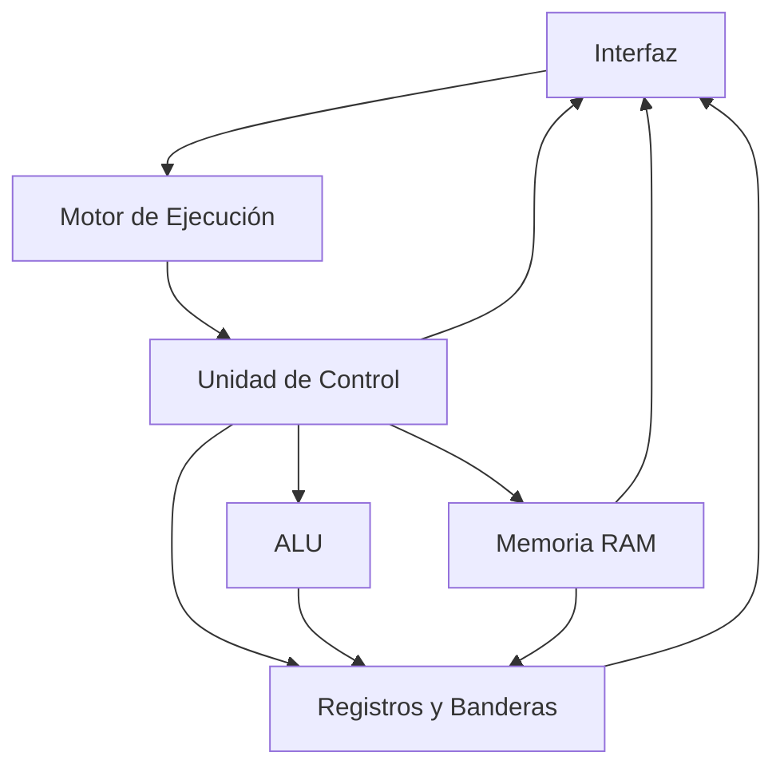

# Arquitectura del Simulador de CPU

## 1. Arquitectura general

El simulador implementa una **arquitectura modular basada en el modelo de von Neumann**, donde las instrucciones y los datos comparten una misma memoria principal.

El sistema fue desarrollado en **Google Sheets**, utilizando **Google Apps Script (JavaScript)** para implementar la lógica del procesador, la memoria, el ciclo de instrucción y los controles de ejecución.

La arquitectura está organizada en los siguientes módulos:

- **Memoria RAM:** almacena instrucciones y datos en 256 posiciones de 8 bits.
- **Registros:** mantienen el estado interno del procesador mediante PC, IR, MAR, MDR, AX y BX.
- **Banderas de estado:** ZF, CF y SF representan condiciones producidas por las operaciones de la ALU.
- **ALU (Unidad Aritmético-Lógica):** realiza operaciones aritméticas, lógicas y de comparación sobre valores de 8 bits.
- **Unidad de Control:** interpreta las instrucciones y coordina las fases Fetch, Decode, Execute y Store.
- **Motor de ejecución:** permite ejecutar el procesador paso a paso o de manera continua.
- **Interfaz:** representa visualmente la RAM, los registros, las banderas, la fase actual y el log de micro-operaciones.

La separación de responsabilidades permite mantener organizada la implementación y evita concentrar toda la lógica del simulador en un único componente.

La arquitectura también constituye una base escalable para futuras ampliaciones, como la incorporación de un **Bus del Sistema, dispositivos de Entrada/Salida (I/O), periféricos e interrupciones**.

---

## 2. Diagrama de arquitectura

El siguiente diagrama representa la organización general del simulador y la comunicación entre sus componentes principales:



La **Interfaz** permite controlar y observar el simulador. Las acciones del usuario son procesadas por el **Motor de Ejecución**, que controla el avance del CPU.

La **Unidad de Control** coordina la memoria, los registros y la ALU de acuerdo con la instrucción y la fase que se esté ejecutando.

Los cambios producidos durante la ejecución son posteriormente reflejados en la interfaz.

---

## 3. Módulos del sistema

| Módulo | Responsabilidad |
|---|---|
| **Memoria RAM** | Almacenar instrucciones y datos en 256 posiciones de 8 bits y permitir operaciones de lectura y escritura. |
| **Registros** | Mantener el estado interno del CPU mediante PC, IR, MAR, MDR, AX y BX. |
| **Banderas** | Representar mediante ZF, CF y SF las condiciones generadas por las operaciones del procesador. |
| **ALU** | Ejecutar operaciones aritméticas, lógicas y de comparación sobre valores de 8 bits. |
| **Unidad de Control** | Decodificar instrucciones y coordinar las fases Fetch, Decode, Execute y Store. |
| **Motor de Ejecución** | Controlar la ejecución paso a paso y continua del CPU. |
| **Interfaz** | Mostrar RAM, registros, banderas, fase actual, controles y log de micro-operaciones. |

Cada módulo posee una responsabilidad específica y se comunica con los demás componentes cuando es necesario para completar el ciclo de instrucción.

---

## 4. Memoria RAM

El simulador implementa una memoria principal de **256 posiciones de 8 bits**, con direcciones comprendidas entre:

```text
00h - FFh
```

Cada dirección almacena exactamente **1 byte**, por lo que los valores permitidos se encuentran entre:

```text
00h - FFh
```

La memoria se representa visualmente mediante una matriz de **16 × 16 posiciones**.

### 4.1. Segmentación lógica

La RAM se divide visual y lógicamente en dos regiones:

| Segmento | Rango | Uso |
|---|---|---|
| **Código** | `00h - 7Fh` | Instrucciones del programa |
| **Datos** | `80h - FFh` | Variables y almacenamiento de datos |

Esta división es lógica: ambos segmentos pertenecen a la misma memoria RAM, manteniendo el principio de memoria compartida de la arquitectura de von Neumann.

### 4.2. Operaciones de memoria

El acceso a RAM se realiza mediante dos operaciones primitivas:

```javascript
Read(address)
Write(address, value)
```

`Read(address)` obtiene el byte almacenado en una dirección válida.

`Write(address, value)` almacena un byte en una dirección válida.

Ambas operaciones validan que las direcciones y valores se encuentren dentro del rango de 8 bits.

### 4.3. Inspección de memoria

Una posición de RAM puede visualizarse mediante diferentes representaciones:

- Hexadecimal
- Binaria
- Decimal
- Mnemónica, cuando el byte corresponde al opcode de una instrucción conocida

Esto permite relacionar directamente el contenido físico de la memoria simulada con las instrucciones ejecutadas por el CPU.

---

## 5. Registros del procesador

El CPU utiliza los siguientes registros de 8 bits:

| Registro | Función |
|---|---|
| **PC** | Program Counter. Contiene la dirección de la siguiente instrucción. |
| **IR** | Instruction Register. Mantiene el opcode de la instrucción actual. |
| **MAR** | Memory Address Register. Contiene la dirección de memoria que está siendo accedida. |
| **MDR** | Memory Data Register. Contiene el dato transferido desde o hacia RAM. |
| **AX** | Registro de propósito general utilizado principalmente como acumulador. |
| **BX** | Registro de propósito general. |

Todos los registros almacenan valores de 8 bits:

```text
00h - FFh
```

---

## 6. Banderas de estado

El simulador implementa tres banderas:

| Bandera | Nombre | Función |
|---|---|---|
| **ZF** | Zero Flag | Se activa cuando el resultado de una operación es cero. |
| **CF** | Carry Flag | Se activa cuando se produce acarreo o desbordamiento sin signo. |
| **SF** | Sign Flag | Refleja el bit más significativo del resultado; indica un valor negativo bajo interpretación en complemento a 2. |

Las banderas son actualizadas por las operaciones correspondientes de la ALU y son utilizadas también por las instrucciones de control de flujo.

Por ejemplo:

```text
FFh + 01h = 00h

ZF = 1
CF = 1
SF = 0
```

---

## 7. Unidad Aritmético-Lógica (ALU)

La ALU procesa valores de 8 bits y mantiene los resultados dentro del rango:

```text
00h - FFh
```

Las operaciones aritméticas utilizadas por la ISA del simulador son:

- `ADD`
- `SUB`
- `INC`
- `DEC`
- `CMP`

La implementación de la ALU también dispone internamente de operaciones lógicas como:

- AND
- OR
- XOR
- NOT

Estas operaciones forman parte de las capacidades internas del módulo ALU, pero **no se exponen como instrucciones de la ISA implementada para este primer parcial**.

Las operaciones correspondientes actualizan las banderas `ZF`, `CF` y `SF`.

---

## 8. Unidad de Control

La Unidad de Control coordina el funcionamiento del procesador.

Sus principales responsabilidades son:

1. Obtener el opcode desde memoria.
2. Identificar la instrucción correspondiente.
3. Decodificar registros, modos de direccionamiento y operandos.
4. Solicitar a la ALU la operación necesaria.
5. Coordinar las transferencias entre registros y memoria.
6. Gestionar los saltos y bifurcaciones.
7. Coordinar el almacenamiento del resultado.
8. Avanzar entre las fases del ciclo de instrucción.

La ejecución de una instrucción no se realiza de forma directa. Cada instrucción atraviesa explícitamente las cuatro fases del ciclo del CPU.

---

## 9. Ciclo de instrucción

Cada instrucción se procesa mediante:

```text
FETCH → DECODE → EXECUTE → STORE
```


### 9.1. Fetch

La fase Fetch obtiene de memoria el opcode de la siguiente instrucción.

Conceptualmente:

```text
PC → MAR
RAM[MAR] → MDR
MDR → IR
PC ← PC + 1
```

Por ejemplo:

```text
MAR=08h, MDR=10h → IR=10h, PC=09h
```

### 9.2. Decode

La Unidad de Control interpreta el opcode almacenado en `IR`, identifica la instrucción, determina su modo de direccionamiento y obtiene los operandos necesarios.

Por ejemplo:

```text
IR=10h → ADD
```

### 9.3. Execute

Se realiza la operación correspondiente.

Puede involucrar:

- operaciones de ALU;
- lectura o escritura de memoria;
- comparación;
- actualización de banderas;
- modificación del PC mediante saltos.

Por ejemplo:

```text
ADD: AX=05h + 03h → resultado=08h
```

### 9.4. Store

El resultado se almacena en el registro o posición de memoria correspondiente cuando la instrucción lo requiere.

Por ejemplo:

```text
Resultado=08h → AX=08h
```

Al finalizar Store, el procesador vuelve a Fetch para comenzar la siguiente instrucción.

---

## 10. Motor de ejecución

El Motor de Ejecución permite controlar cómo avanza el ciclo del CPU.

El simulador dispone de dos modalidades principales:

### Ejecución paso a paso

Mediante `STEP`, cada acción avanza exactamente una fase:

```text
FETCH
↓
DECODE
↓
EXECUTE
↓
STORE
```

Esto permite observar detalladamente las modificaciones internas del procesador.

### Ejecución continua

Mediante `RUN`, el procesador avanza automáticamente por las mismas fases hasta:

- ejecutar `HLT`;
- ser detenido mediante `PAUSE`;
- producirse un error.

La velocidad de ejecución puede ajustarse para facilitar la observación visual del flujo.

El modo continuo utiliza el mismo ciclo de ejecución que STEP, por lo que ambos producen el mismo estado final para un mismo programa.

---

## 11. Interfaz y visualización

La interfaz desarrollada en Google Sheets permite observar el estado del CPU durante la ejecución.

Incluye:

- matriz RAM de 256 posiciones;
- diferenciación visual entre código y datos;
- registros internos;
- banderas;
- fase actual;
- editor del programa;
- controles de ejecución;
- inspector de memoria;
- log de micro-operaciones.

Durante la ejecución se resaltan los componentes involucrados en cada fase, permitiendo observar visualmente el flujo interno del CPU.

El log registra cronológicamente las operaciones realizadas.

Por ejemplo:

```text
FETCH    MAR=08h, MDR=10h → IR=10h, PC=09h
DECODE   IR=10h → ADD
EXECUTE  ADD: AX=05h + 03h → resultado=08h
STORE    Resultado=08h → AX=08h
```

---

## 12. Arquitectura del conjunto de instrucciones (ISA)

La **ISA (Instruction Set Architecture)** define las instrucciones que la Unidad de Control puede reconocer y ejecutar.

Los opcodes son valores de 8 bits expresados en hexadecimal.

### 12.1. Transferencia de datos

| Opcode | Instrucción | Descripción |
|:---:|---|---|
| `01h` | `MOV reg, imm` | Carga un valor inmediato en un registro. |
| `02h` | `MOV reg, reg` | Copia el contenido de un registro a otro. |
| `03h` | `LOAD reg, [dir]` | Carga en un registro el byte almacenado en una dirección de memoria. |
| `04h` | `STORE [dir], reg` | Guarda en memoria el contenido de un registro. |

### 12.2. Aritmética y comparación

| Opcode | Instrucción | Descripción |
|:---:|---|---|
| `10h` | `ADD reg, imm/reg` | Suma un valor inmediato o registro al registro destino. |
| `11h` | `SUB reg, imm/reg` | Resta un valor inmediato o registro al registro destino. |
| `12h` | `INC reg` | Incrementa un registro en una unidad. |
| `13h` | `DEC reg` | Decrementa un registro en una unidad. |
| `14h` | `CMP reg, imm/reg` | Compara valores y actualiza las banderas sin almacenar el resultado. |

### 12.3. Control de flujo

| Opcode | Instrucción | Descripción |
|:---:|---|---|
| `20h` | `JMP dir` | Salta incondicionalmente a una dirección. |
| `21h` | `JZ dir` | Salta cuando `ZF=1`. |
| `22h` | `JNZ dir` | Salta cuando `ZF=0`. |
| `FFh` | `HLT` | Detiene la ejecución del procesador. |

Los opcodes se organizan por categoría:

```text
01h - 0Fh → Transferencia de datos
10h - 1Fh → Aritmética y comparación
20h - 2Fh → Control de flujo
FFh       → Detención
```

---

## 13. Codificación de registros

Los registros de propósito general utilizados como operandos poseen la siguiente codificación:

| Código | Registro |
|:---:|---|
| `00h` | `AX` |
| `01h` | `BX` |

---

## 14. Modos de direccionamiento

Para las instrucciones que admiten diferentes tipos de operandos se utilizan los siguientes códigos:

| Código | Modo | Descripción |
|:---:|---|---|
| `00h` | Registro | El operando se obtiene desde otro registro. |
| `01h` | Inmediato | El operando se encuentra directamente dentro de la instrucción. |
| `02h` | Memoria | Identifica el direccionamiento asociado a memoria cuando corresponde. |

---

## 15. Formato de instrucciones

Las instrucciones tienen longitud variable dependiendo de sus operandos.

| Instrucción | Formato en memoria | Bytes |
|---|---|:---:|
| `MOV reg, imm/reg` | Opcode + Registro + Modo + Operando | 4 |
| `ADD reg, imm/reg` | Opcode + Registro + Modo + Operando | 4 |
| `SUB reg, imm/reg` | Opcode + Registro + Modo + Operando | 4 |
| `CMP reg, imm/reg` | Opcode + Registro + Modo + Operando | 4 |
| `INC reg` | Opcode + Registro | 2 |
| `DEC reg` | Opcode + Registro | 2 |
| `LOAD reg, [dir]` | Opcode + Registro + Dirección | 3 |
| `STORE [dir], reg` | Opcode + Dirección + Registro | 3 |
| `JMP dir` | Opcode + Dirección | 2 |
| `JZ dir` | Opcode + Dirección | 2 |
| `JNZ dir` | Opcode + Dirección | 2 |
| `HLT` | Opcode | 1 |

### Ejemplo: operando inmediato

```text
ADD AX, 05h
```

se codifica como:

```text
10 00 01 05
```

donde:

```text
10 → opcode ADD
00 → registro AX
01 → modo inmediato
05 → valor inmediato
```

### Ejemplo: operando en registro

```text
ADD AX, BX
```

se codifica como:

```text
10 00 00 01
```

donde:

```text
10 → opcode ADD
00 → registro destino AX
00 → modo registro
01 → registro BX
```

### Ejemplo: LOAD

```text
LOAD BX, [80h]
```

se codifica como:

```text
03 01 80
```

donde:

```text
03 → opcode LOAD
01 → registro BX
80 → dirección de memoria
```

### Ejemplo: STORE

```text
STORE [80h], AX
```

se codifica como:

```text
04 80 00
```

donde:

```text
04 → opcode STORE
80 → dirección de memoria
00 → registro AX
```

La diferencia entre `LOAD` y `STORE` refleja el orden de sus operandos en la ISA implementada.

---

## 16. Programa demostrativo

Para comprobar el funcionamiento integrado del procesador se utiliza el siguiente programa:

```asm
MOV AX, 00h
MOV BX, 05h
INC AX
CMP AX, BX
JZ 12h
JMP 08h
STORE [80h], AX
HLT
```

Su distribución en memoria es:

| Dirección | Instrucción |
|:---:|---|
| `00h` | `MOV AX, 00h` |
| `04h` | `MOV BX, 05h` |
| `08h` | `INC AX` |
| `0Ah` | `CMP AX, BX` |
| `0Eh` | `JZ 12h` |
| `10h` | `JMP 08h` |
| `12h` | `STORE [80h], AX` |
| `15h` | `HLT` |

El programa incrementa `AX` mediante un bucle hasta que alcanza el valor almacenado en `BX`.

Mientras:

```text
AX != BX
```

`CMP` mantiene `ZF=0`, `JZ` no realiza el salto y `JMP 08h` regresa al inicio del bucle.

Cuando:

```text
AX = BX = 05h
```

la comparación produce:

```text
ZF = 1
```

por lo que `JZ 12h` toma la bifurcación.

Finalmente:

```text
STORE [80h], AX
```

almacena el resultado en el segmento de datos y `HLT` detiene el procesador.

El resultado verificable es:

```text
AX        = 05h
BX        = 05h
RAM[80h]  = 05h
ZF        = 1
```

Este programa permite demostrar de manera integrada:

- ejecución secuencial;
- operaciones aritméticas;
- comparación;
- actualización de banderas;
- bucles;
- bifurcaciones condicionales;
- saltos incondicionales;
- escritura en memoria;
- detención mediante `HLT`.

---

## 17. Preparación para futuras extensiones

La arquitectura modular permite continuar desarrollando el simulador sin reemplazar el núcleo construido para esta primera etapa.

Entre las ampliaciones previstas se encuentran:

- **Bus del Sistema:** comunicación estructurada entre CPU, memoria y otros componentes.
- **Entrada/Salida (I/O):** interacción con dispositivos externos simulados.
- **Periféricos:** incorporación de dispositivos conectados al sistema.
- **Interrupciones:** modificación controlada del flujo normal de ejecución ante eventos externos.

La separación existente entre **Memoria, Registros, ALU, Unidad de Control, Motor de Ejecución e Interfaz** proporciona una base para incorporar progresivamente estos componentes.

De esta manera, el simulador desarrollado para el primer parcial representa el núcleo funcional sobre el cual puede evolucionar una arquitectura de computadora más completa.
