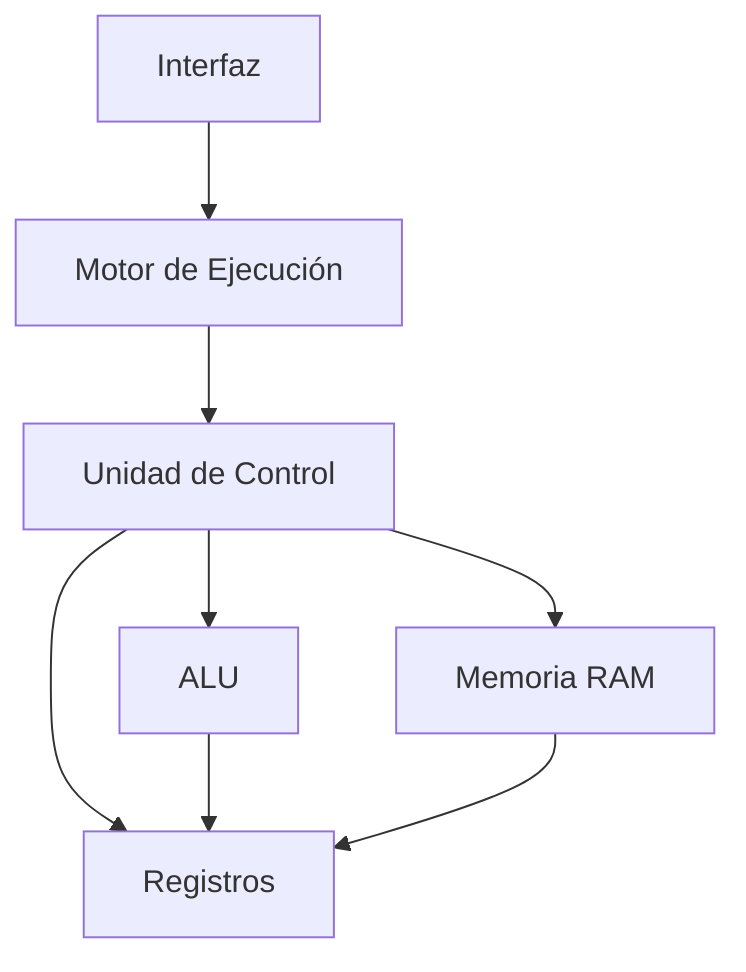
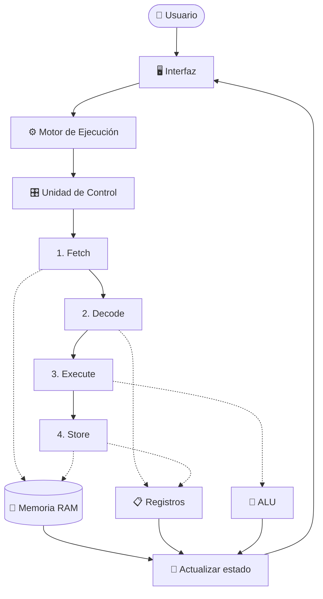

# Arquitectura del Simulador de CPU

## 1. Arquitectura general

El simulador está diseñado siguiendo una **arquitectura modular basada en el modelo de von Neumann**, separando las responsabilidades principales del sistema en componentes independientes.

La arquitectura se divide en los siguientes módulos:

- **Memoria RAM:** almacena las instrucciones y los datos utilizados durante la ejecución.
- **Registros:** mantienen el estado interno del procesador, incluyendo PC, IR, MAR, MDR, AX, BX y las banderas ZF, CF y SF.
- **ALU (Unidad Aritmético-Lógica):** realiza las operaciones aritméticas y lógicas.
- **Unidad de Control:** interpreta las instrucciones y coordina las fases Fetch, Decode, Execute y Store.
- **Motor de ejecución:** controla la ejecución paso a paso y continua del simulador.
- **Interfaz:** permite visualizar el estado de la memoria, los registros y el proceso de ejecución.

Esta separación evita concentrar toda la lógica del simulador en un único componente y facilita el mantenimiento y la comprensión del sistema.

Además, la arquitectura está preparada para futuras ampliaciones, permitiendo incorporar posteriormente elementos como el **Bus del Sistema, dispositivos de Entrada/Salida (I/O), periféricos e interrupciones** sin tener que rediseñar completamente el simulador.

## 2. Diagrama de arquitectura

El siguiente diagrama representa la organización general del simulador y la relación entre sus principales módulos:



La **Interfaz** permite al usuario controlar el simulador mediante el **Motor de Ejecución**. Este solicita a la **Unidad de Control** avanzar en el ciclo de instrucción.

La Unidad de Control coordina los **Registros**, la **ALU** y la **Memoria RAM** según la instrucción y la fase que se esté ejecutando.

## 3. Módulos del sistema

El simulador se divide en módulos con responsabilidades específicas para mantener una estructura organizada y facilitar futuras ampliaciones.

| Módulo | Responsabilidad |
|---|---|
| **Memoria RAM** | Almacenar las instrucciones y datos en 256 posiciones de 8 bits, además de permitir operaciones de lectura y escritura. |
| **Registros** | Mantener el estado interno del CPU mediante los registros PC, IR, MAR, MDR, AX, BX y las banderas ZF, CF y SF. |
| **ALU** | Realizar las operaciones aritméticas, lógicas y de comparación requeridas por las instrucciones. |
| **Unidad de Control** | Interpretar las instrucciones y coordinar las fases Fetch, Decode, Execute y Store. |
| **Motor de Ejecución** | Controlar el avance de la simulación, tanto paso a paso como de forma continua. |
| **Interfaz** | Mostrar visualmente la memoria, registros, estado de ejecución y controles disponibles para el usuario. |

Cada módulo tendrá una responsabilidad definida y se comunicará con los demás únicamente cuando sea necesario para ejecutar el ciclo de instrucción.

## 4. Flujo general de ejecución

La ejecución comienza cuando el usuario inicia o avanza la simulación desde la interfaz. A partir de ese momento, los módulos trabajan de forma coordinada para completar el ciclo de instrucción.



Cada instrucción atraviesa cuatro fases:

1. **Fetch:** obtiene de la memoria la siguiente instrucción indicada por el PC.
2. **Decode:** interpreta el opcode e identifica los operandos necesarios.
3. **Execute:** realiza la operación correspondiente mediante la ALU o la Unidad de Control.
4. **Store:** almacena el resultado en un registro o posición de memoria cuando corresponda.

Al finalizar cada fase, el estado actualizado de los registros, la memoria y la ejecución se refleja en la interfaz, permitiendo observar visualmente el funcionamiento interno del simulador.

## 5. Diseño inicial de la ISA

La **ISA (Instruction Set Architecture)** define el conjunto de instrucciones que podrá reconocer y ejecutar el simulador.

Cada instrucción tendrá asociado un **opcode** que permitirá a la Unidad de Control identificar la operación que debe realizar. Los opcodes se representan en hexadecimal y se agrupan según el tipo de instrucción.

### 5.1. Transferencia de datos

| Opcode | Instrucción | Descripción |
|:---:|---|---|
| `01h` | `MOV reg, imm` | Carga un valor inmediato en un registro. |
| `02h` | `MOV reg, reg` | Copia el contenido de un registro a otro. |
| `03h` | `LOAD reg, [dir]` | Carga en un registro un valor almacenado en memoria. |
| `04h` | `STORE [dir], reg` | Guarda el contenido de un registro en memoria. |

### 5.2. Aritmética y comparación

| Opcode | Instrucción | Descripción |
|:---:|---|---|
| `10h` | `ADD reg, imm/reg` | Suma un valor o registro al registro indicado. |
| `11h` | `SUB reg, imm/reg` | Resta un valor o registro al registro indicado. |
| `12h` | `INC reg` | Incrementa el registro en una unidad. |
| `13h` | `DEC reg` | Decrementa el registro en una unidad. |
| `14h` | `CMP reg, imm/reg` | Compara dos valores y actualiza las banderas. |

### 5.3. Control de flujo

| Opcode | Instrucción | Descripción |
|:---:|---|---|
| `20h` | `JMP dir` | Realiza un salto incondicional a una dirección. |
| `21h` | `JZ dir` | Salta si la bandera ZF está activa. |
| `22h` | `JNZ dir` | Salta si la bandera ZF está inactiva. |
| `FFh` | `HLT` | Detiene la ejecución del programa. |

> **Nota:** los valores de los opcodes son definidos para este simulador. El conjunto de instrucciones se basa en los requerimientos mínimos establecidos para el proyecto.

Esta organización permite reservar diferentes rangos de opcodes según su función:

- `01h – 0Fh`: transferencia de datos.
- `10h – 1Fh`: operaciones aritméticas y de comparación.
- `20h – 2Fh`: control de flujo.
- `FFh`: detención del procesador.

La estructura podrá ampliarse posteriormente agregando nuevas instrucciones sin modificar las categorías existentes.

### 5.4. Codificación de instrucciones

Para que la Unidad de Control pueda decodificar las instrucciones almacenadas en memoria, se define cómo se representan los registros, modos de direccionamiento y operandos mediante bytes de 8 bits.

#### Codificación de registros

| Código | Registro |
| ------ | -------- |
| `00h` | `AX` |
| `01h` | `BX` |

#### Modos de direccionamiento

| Código | Modo | Descripción |
| ------ | ---- | ----------- |
| `00h` | Registro | El operando se encuentra en otro registro. |
| `01h` | Inmediato | El operando es un valor incluido directamente en la instrucción. |
| `02h` | Memoria | El operando corresponde a una dirección de memoria. |

#### Formato de las instrucciones

Las instrucciones pueden ocupar diferente cantidad de bytes dependiendo de los operandos requeridos.

| Instrucciones | Formato | Bytes |
| ------------- | ------- | ----- |
| `MOV reg, imm/reg` | Opcode + Registro + Modo + Operando | 4 |
| `ADD`, `SUB`, `CMP` | Opcode + Registro + Modo + Operando | 4 |
| `INC`, `DEC` | Opcode + Registro | 2 |
| `LOAD`, `STORE` | Opcode + Registro + Dirección | 3 |
| `JMP`, `JZ`, `JNZ` | Opcode + Dirección | 2 |
| `HLT` | Opcode | 1 |

Por ejemplo, la instrucción:

```text
ADD AX, 05h
```

se representa en memoria como:

```text
10 00 01 05
```

donde:

```text
10 → opcode ADD
00 → registro AX
01 → modo inmediato
05 → operando
```

Mientras que:

```text
ADD AX, BX
```

se representa como:

```text
10 00 00 01
```

donde `00h` indica direccionamiento por registro y `01h` identifica al registro `BX`.

Esta codificación permite que la fase **Decode** interprete el opcode, identifique el modo de direccionamiento y prepare los operandos antes de pasar a **Execute**.

## 6. Preparación para futuras extensiones

La arquitectura modular del simulador permite incorporar nuevos componentes sin modificar completamente los módulos existentes.

En futuras versiones, el sistema podrá ampliarse con:

- **Bus del Sistema:** para comunicar CPU, memoria y otros componentes.
- **Entrada/Salida (I/O):** para gestionar la comunicación con dispositivos externos.
- **Periféricos:** para simular dispositivos conectados al computador.
- **Interrupciones:** para permitir que eventos externos modifiquen temporalmente el flujo normal de ejecución.

La separación entre **Memoria, Registros, ALU, Unidad de Control, Motor de Ejecución e Interfaz** permite que estas ampliaciones se integren progresivamente, manteniendo organizada la estructura del simulador.

De esta manera, el diseño realizado para el primer parcial funciona como base para continuar evolucionando la arquitectura en las siguientes etapas del proyecto.
